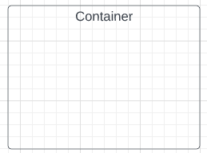

# Casos de Uso

## Introdução

Casos de Uso são utilizados para descrever um conjunto de ações que um sistema deve desempenhar em colaboração com os usuários externos ao sistema. Ele pode ser usado para descrever as principais funcionalidades do sistema e a interação com os usuários.

## Metodologia

Para criação dos casos de uso foram identificados e analisados os documentos de elicitação de requisitos. A partir disso, foram feitos os casos de uso utilizando a ferramenta Draw.io.

### Elementos do diagrama

Um diagrama de casos de uso é composto pelos elementos descritos a seguir.

### Atores

Representam usuários que fazem a interação com o sistema. Geralmente são representados por bonecos (Figura 1).

 Figura 1: Ator (Fonte: autores, 2022).

### Limite do sistema

Define até onde o sistema tem seu escopo, normamente são representados por uma caixa (Figura 2).

 Figura 2: Cenário (Fonte: autores, 2022).

### Caso de uso

Representam os diferentes usos que o usuário pode fazer. Geralmente são definidos na forma oval horizontal (Figura 3).

 Figura 3: Caso de uso (Fonte: autores, 2022).

### Relacionamentos

São utilizados para representar as interações entre os atores e os casos de uso. Os relacionamentos podem ser definidos de duas formas, sendo elas:

**Inclusão:** Relação em que um caso de uso quando precisa ter sua funcionalidade executada através de outro caso de uso.

- Notação no diagrama: *<<includes\>\>*

**Extensão:** São usados para mostrar um comportamento opcional, que somente é executado sobre determinadas condições.

- Notação no diagrama: *<<extends\>\>*

## Diagrama de Casos de Uso

## Bibliografia

> SERRANO, Milene; SERRANO, Maurício. Requisitos - Aula 13. Disponível na plataforma Aprender3. Acessado em 08 de dez. de 2022.

> Ferramenta Draw.io, disponível no [link](https://app.diagrams.net/). Acessado em 08 de dez. de 2022.

## Histórico de Versão

|    Data    | Versão |                     Descrição                     |        Autor(es)        | Revisor(es) |
| :--------: | :----: | :-----------------------------------------------: | :---------------------: | :---------: |
| 11/12/2022 |  1.0   |           Criação inicial do documento            |     Wengel Rodrigues    |   Thiago    |