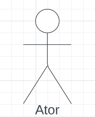
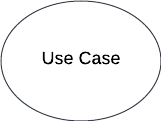
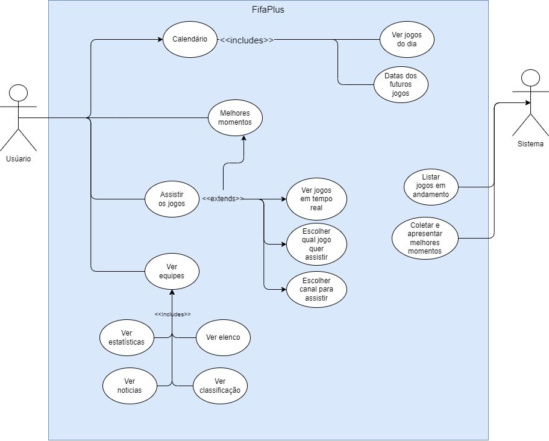

# Casos de Uso

## Introdução

Casos de Uso são utilizados para descrever um conjunto de ações que um sistema deve desempenhar em colaboração com os usuários externos ao sistema. Ele pode ser usado para descrever as principais funcionalidades do sistema e a interação com os usuários.

## Metodologia

Para criação dos casos de uso foram identificados e analisados os documentos de elicitação de requisitos. A partir disso, foram feitos os casos de uso utilizando a ferramenta Draw.io.

### Elementos do diagrama

Um diagrama de casos de uso é composto pelos elementos descritos a seguir.

### Atores

Representam usuários que fazem a interação com o sistema. Geralmente são representados por bonecos (Figura 1).

 Figura 1: Ator (Fonte: autores, 2022).

### Limite do sistema

Define até onde o sistema tem seu escopo, normamente são representados por uma caixa (Figura 2).

 Figura 2: Cenário (Fonte: autores, 2022).

### Caso de uso

Representam os diferentes usos que o usuário pode fazer. Geralmente são definidos na forma oval horizontal (Figura 3).

 Figura 3: Caso de uso (Fonte: autores, 2022).

### Relacionamentos

São utilizados para representar as interações entre os atores e os casos de uso. Os relacionamentos podem ser definidos de duas formas, sendo elas:

**Inclusão:** Relação em que um caso de uso quando precisa ter sua funcionalidade executada através de outro caso de uso.

- Notação no diagrama: *<<includes\>\>*

**Extensão:** São usados para mostrar um comportamento opcional, que somente é executado sobre determinadas condições.

- Notação no diagrama: *<<extends\>\>*

## Diagrama de Casos de Uso

 Figura 4: Diagrama de casos de uso (Fonte: autores, 2022).

A seguir, nas Tabelas 1, 2, 3 e 4, a especificação dos casos de uso identificados.

### UC01. Calendário

| **UC01**                | **Calendário** |
| ----------------------: | :------------- |
| **Atores**              | Usuário |
| **Frequência de uso**   | Alta |
| **Requisitos**          | Aplicativo instalado, conexão com a internet |
| **Pré condições**       | O usuário seleciona o menu e depois a opção "calendário" |
| **Fluxo principal**     | <ol> <li> O sistema mostra a classificação das seleções por grupos e seções suspensas com informações sobre cada uma das fases de mata-mata com a opção de expandir as seções </ol> |
| **Fluxos alternativos** | <ol> <li> O usuário expande a seção de uma fase de mata-mata específica para visualizar as partidas além de visualizar a classificação das seleções dentro dos grupos </ol> |
| **Pós condições**       | O usuário consegue visualizar as datas e resultados das partidas até então definidas |
| **Rastreabilidade**     | RF07, ST03 |

 Tabela 1: UC01 - Calendário (Fonte: autores, 2022).

### UC02. Melhores momentos

| **UC02**                | **Melhores momentos** |
| ----------------------: | :-------------------- |
| **Atores**              | Usuário |
| **Frequência de uso**   | Média |
| **Requisitos**          | Aplicativo instalado, conexão com a internet |
| **Pré condições**       | O usuário seleciona o botão "melhores momentos" no menu inferior |
| **Fluxo principal**     | <ol> <li> O sistema exibe uma tela com uma breve descrição do que se trata a funcionalidade, seguida por várias seções: melhores momentos mais recentes; todos os melhores momentos; melhores momentos com linguagem de sinais; os clubes com mais gols na copa do mundo FIFA; veja seus gols; seção com filtros para obter os melhores momentos de acordo com a fase da competição; seção semelhante à do calendário com informações sobre os grupos e as fases de mata-mata; arquivo com melhores momentos de edições anteriores da copa. <li> O usuário seleciona um vídeo para visualizar <li> O sistema faz o carregamento do vídeo, exibe uma breve descrição do vídeo, com data, duração, opção de compartilhamento externo, exibe sugestões de outros vídeos a serem visualizados e exibe propagandas de outros recursos dos aplicativos da FIFA </ol> |
| **Fluxos alternativos** | <ol> <li> O usuário clica em "ver tudo" em uma das seções <li> O sistema exibe uma grade com diversos vídeos da vategoria selecionada que pode ser expandida através do botão "ver mais" <li> O usuário seleciona um vídeo e ocorre uma visualização semelhante à descrita no ponto 3 do fluxo principal <li> O usuário clica em "ver mais" e mais opções de vídeos são carregadas <li> A grade com a lista de vídeos disponíveis na categoria é carregada completamente e não há mais a exibição do botão "ver mais" </ol> |
| **Pós condições**       | O usuário consegue visualizar os melhores momentos de acordo com a categoria que desejar |
| **Rastreabilidade**     | REQ01-06 |

 Tabela 2: UC02 - Melhores momentos (Fonte: autores, 2022).

### UC03. Assistir os jogos

| **UC03**                | **Assistir os jogos** |
| ----------------------: | :-------------------- |
| **Atores**              | Usuário |
| **Frequência de uso**   | Alta |
| **Requisitos**          | Aplicativo instalado, conexão com a internet |
| **Pré condições**       | O usuário clica em "FIFA WORLD CUP QATAR 2022", no menu inferior |
| **Fluxo principal**     | <ol> <li> O sistema exibe uma página com um carrossel de notícias recentes, seguido de opções para acessar as próximas partidas, vídeos de entrevistas e notícias sobre a copa, uma seção com jogos competos para rever, uma seção com coletivas de imprensa das seleções e links para outras funcionalidades do app <li> O usuário seleciona uma partida para ver informações <li> O sistema apresenta uma página com informações de horário, seleções participantes da partida, onde assistir e, se for o caso, um cronômetro de contagem regressiva para a partida ou o vídeo para ver a transmissão ao vivo ou transmissões que já ocorreram, além das estatísticas da partida <li> O usuário vê as informações sobre a partida e, se for o caso, aperta no botão de play <li> Se for o caso, o sistema exibe a partida </ol> |
| **Fluxos alternativos** | Não há |
| **Pós condições**       | O usuário assiste à partida desejada em tempo real, assiste a partidas anteriores ou acessa notícias recentes sobre a copa e as seleções ou acessa outras funcionalidades do app |
| **Rastreabilidade**     | RF01-05, RF08, RF10 |

 Tabela 3: UC03 - Assistir os jogos (Fonte: autores, 2022).

### UC04. Ver equipes

| **UC04**                | **Ver equipes** |
| ----------------------: | :-------------- |
| **Atores**              | Usuário |
| **Frequência de uso**   | Média |
| **Requisitos**          | Aplicativo instalado, conexão com a internet |
| **Pré condições**       | O usuário clica no botão "equipes" no menu inferior |
| **Fluxo principal**     | <ol> <li> O sistema exibe uma grade com botões com a bandeira, nome e silga de todas as seleções participantes do evento <li> O usuário seleciona uma das seleções <li> O sistema exibe uma página contendo quatro seções principais: notícias, onde há notícias principais sobre a equipe, estatísticas gerais, vídeos de arquivo, elenco; calendário, onde há informações sobre todas as partidas que a seleção disputou, com local, data, horário, resultado, as próximas partidas definidas para a equipe, além de notícias e melhores momentos e o calendário; estatísticas, onde são exibidas diversas estatísticas da equipe e dos jogadores; e elenco, onde é exibida uma grade com imagens, nome, número e posição de todos os jogadores da equipe. <li> O usuário navega pelas seções </ol> |
| **Fluxos alternativos** | <ol> <li> O usuário seleciona uma notícia para ver <li> O sistema exibe a página da notícia </ol> |
| **Pós condições**       | O usuário consegue ver informações sobre o elenco da seleção, as estatísticas do time,  calendário de jogos do time e/ou notícias relacionadas à seleção |
| **Rastreabilidade**     | RF06, ST02, REQ01-10 |

 Tabela 3: UC03 - Ver equipes (Fonte: autores, 2022).

## Bibliografia

> SERRANO, Milene; SERRANO, Maurício. Requisitos - Aula 13. Disponível na plataforma Aprender3. Acessado em 08 de dez. de 2022.

> Ferramenta Draw.io, disponível no [link](https://app.diagrams.net/). Acessado em 08 de dez. de 2022.

## Histórico de Versão

|    Data    | Versão |                     Descrição                     |        Autor(es)        | Revisor(es) |
| :--------: | :----: | :-----------------------------------------------: | :---------------------: | :---------: |
| 11/12/2022 |  1.0   |           Criação inicial do documento            |     Wengel Rodrigues    |   Thiago    |
| 12/12/2022 |  1.1   |           Adicionado diagrama de casos            |     Wengel Rodrigues    |   Thiago    |
| 12/12/2022 |  1.2   |   Adicionando a especificação dos casos de uso    | Charles Serafim Morais  |   Wengel    |