# Cenários 

## 1. Introdução
"Cenários são considerados descrições evolutivas de situações num ambiente [9], sendo compostos por um conjunto ordenado de interações entre seus participantes." (Puc-rio, 2022). 

Pode-se entender, por tanto, cenários como situações de interações entre usuários ou agentes externos com o sistema em desenvolvimento, e possívelmente suas interações com sistemas semelhantes. Essas interações consistem em atividades reais e concretas que o usuário possívelmente buscaria completar no sistema, e por fornecerem essa visão do usuário, podem facilitar o processo de descoberta de novos requisitos, ou de desconsideração de requisitos já elicitados, com base nas necessidades e dificuldades identificadas durante o fluxo do usuário pelo sistema.

## 2. Metodologia
Os cenários desenvolvidos nesse documento, foram construidos com base nos requisitos funcionais elicitados nas etapas de elicitação do projeto, e foram moldados com base nos seguintes parâmetros, que foram extraídos do artigo sobre cenários da PUC-rio: 

### Título

Identificador do cenário

### Objetivo

Representa o que se quer atingir com o cenário, devemos nos perguntar o que o usuário espera obter com a conclusão desse cenário, e o cenário deve descrever como esse objetivo deve ser atingido.

### Contexto 

Situação em que o usuário encontra-se quando inicia determinado fluxo no sistema

### Recurso

Objetos com os quais os agentes lidam durante o cenário, na tentativa de cumprir seu objetivo. Podem ser descritos recursos auxiliares ou restritivos (*constraints*) para a conclusão do objetivo

### Ator

Representa o agente que tem algum papel no cenário, não necessáriamente precisa ser uma pessoa

### Episódio

Ações realizadas pelos atores com participação de outros atores, e com a utilização de recursos disponíveis, e podem conter restições (*constraints*) ou exceções (*exceptions*)

## 3. Dicionário de termos

Para facilitar o entendimento dos cenários e do jargão técnico relacionado e eles, foi desenvolvido o seguinte dicionário de termos, disponível na (tabela 01).

| _Termo_      | Descrição                                                                                       |
|--------------|-------------------------------------------------------------------------------------------------|
| _title_      | Título do cenário                                                                               |
| _goal_       | Objetivo do cenário                                                                             |
| _context_    | Contexto do cenário. Pode envolver situações inciais, pré-condições, local (físico) e tempo.    |
| _constraint_ | Restrição. Qualquer condição que restrinja o cenário e seu escopo.                              |
| _resource_   | Recursos disponíveis aos atores do cenário                                                      |
| _actor_      | Atores do cenário, pessoas ou estruturas organizacionais que tem um papel e executam o cenário. |
| _episode_    | Ações realizadas no cenário. Podem envolver restrições e exceções.                              |
| _exception_  | Exceções. Tratamentos para situações excepcionais (fora do padrão) para o cenário.              |

###### Tabela 01 - Dicionário de termos. Fonte: Autoria própria.

## 4. Cenários

Abaixo nas (Figuras de 01 a 15) são apresentados os cenários construídos com base nos requisitos funcionais elicitados para o Fifa plus.

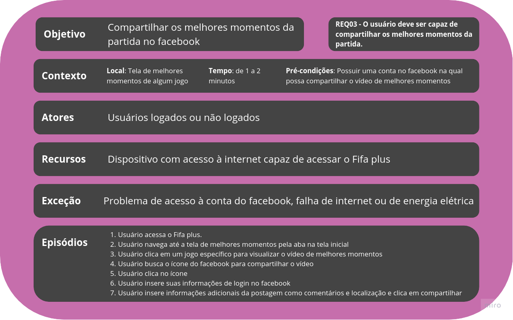

 Figura 1: Cenário 1. Fonte: Autoria própria.

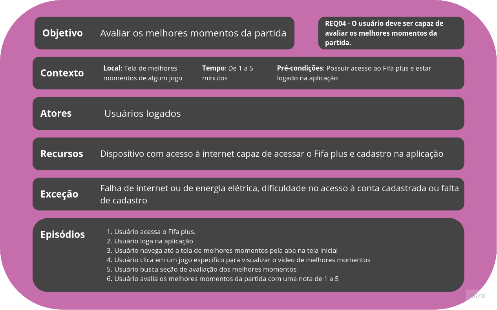

 Figura 2: Cenário 2. Fonte: Autoria própria.

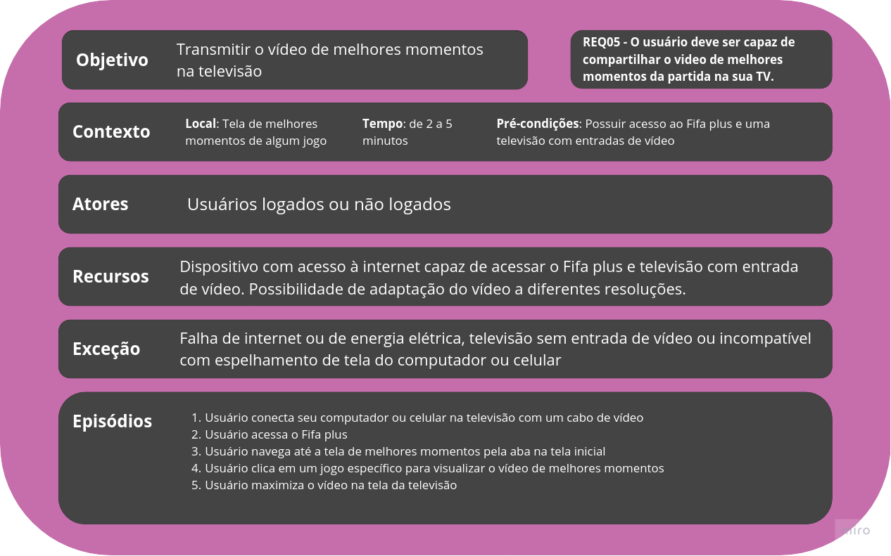

 Figura 3: Cenário 3. Fonte: Autoria própria.

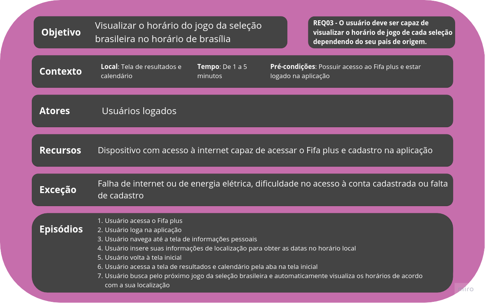

 Figura 4: Cenário 4. Fonte: Autoria própria.

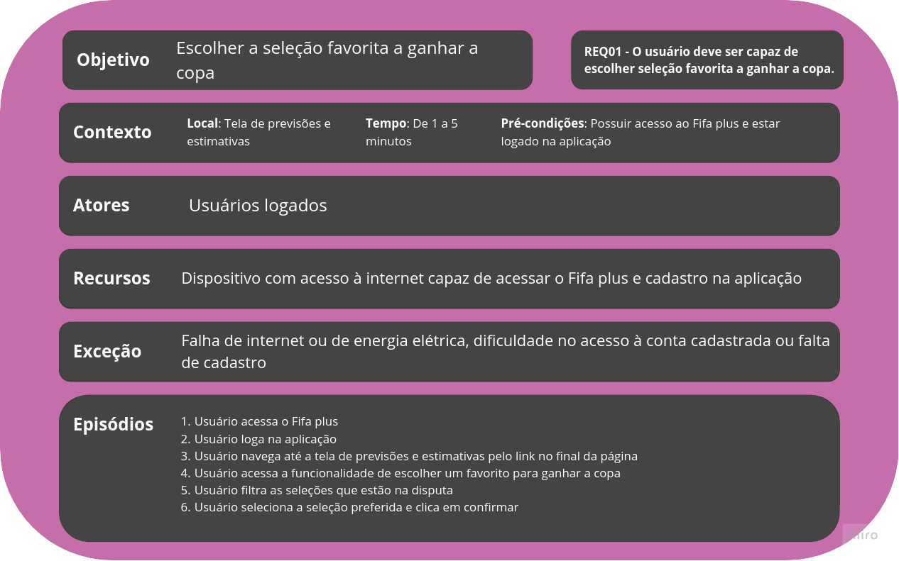

 Figura 5: Cenário 5. Fonte: Autoria própria.

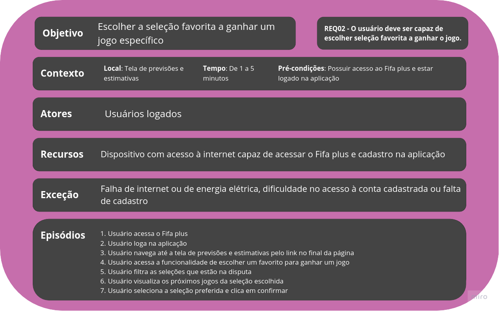

 Figura 6: Cenário 6. Fonte: Autoria própria.

 Figura 6: Cenário 6. Fonte: Autoria própria.

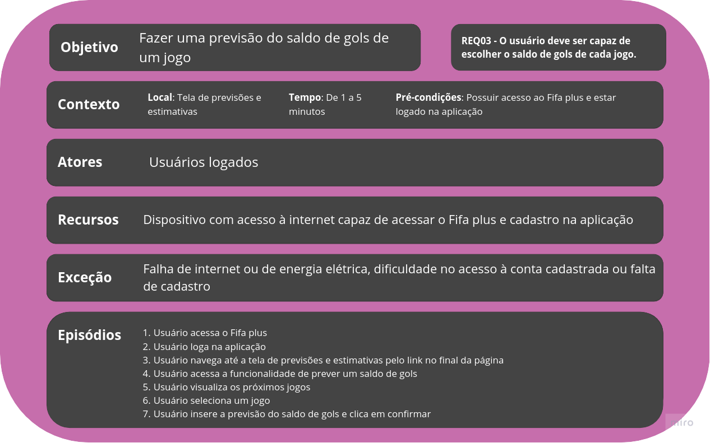

 Figura 7: Cenário 7. Fonte: Autoria própria.

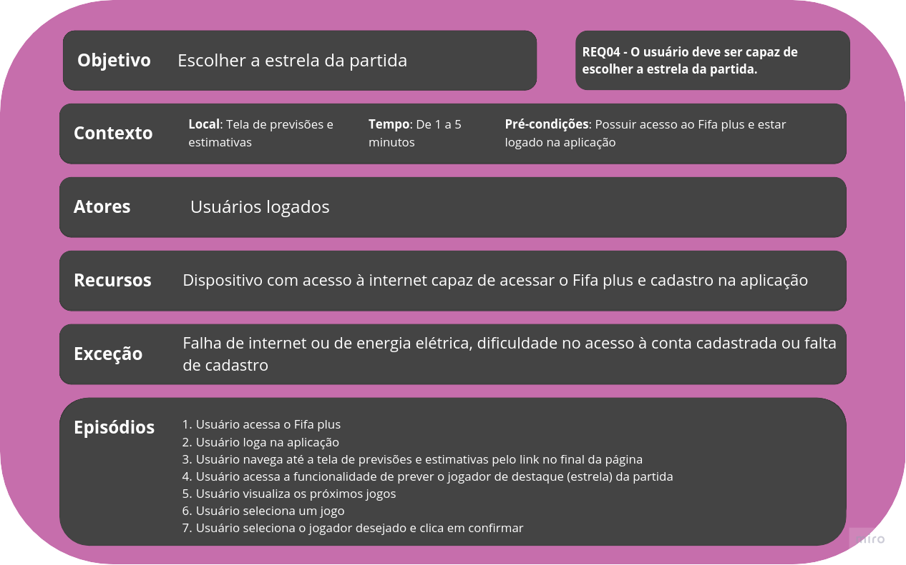

 Figura 8: Cenário 8. Fonte: Autoria própria.

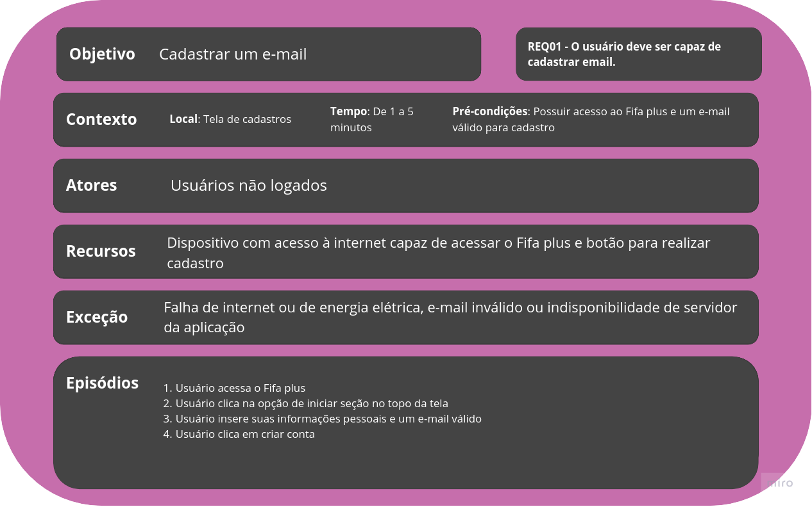

 Figura 9: Cenário 9. Fonte: Autoria própria.

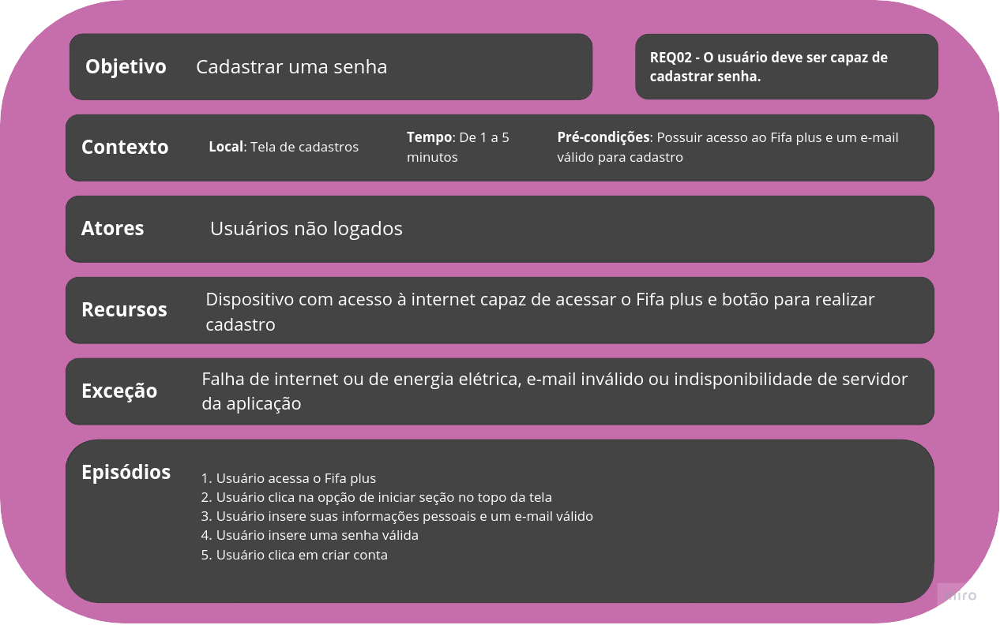

 Figura 10: Cenário 10. Fonte: Autoria própria.

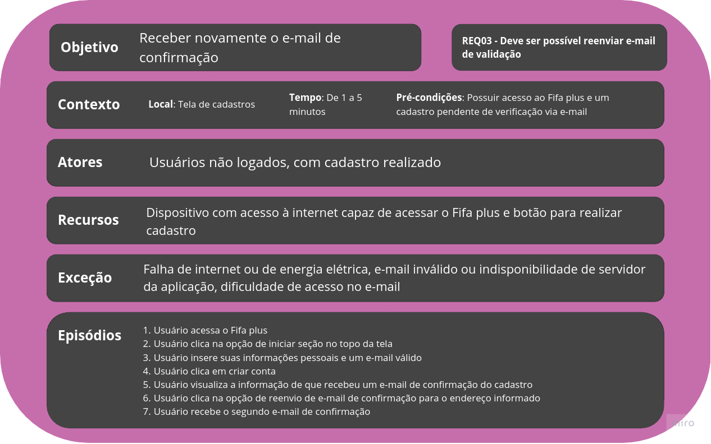

 Figura 11: Cenário 11. Fonte: Autoria própria.

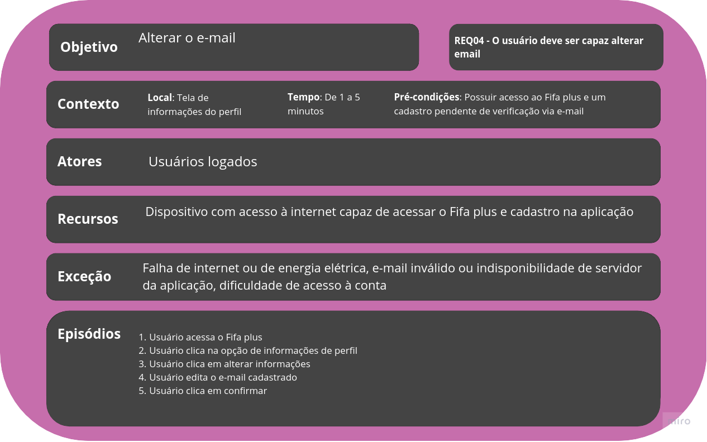

 Figura 12: Cenário 12. Fonte: Autoria própria.

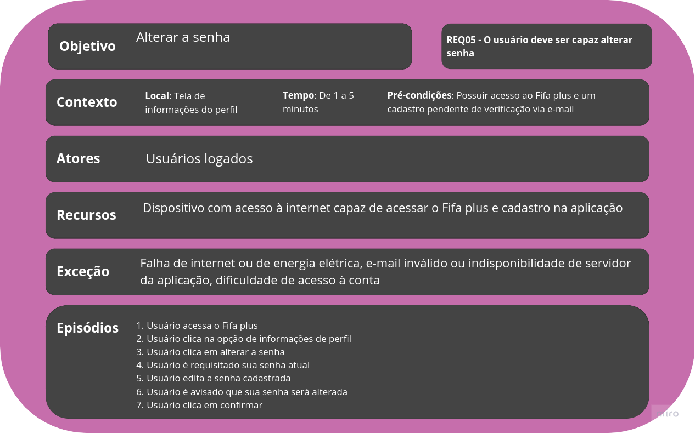

 Figura 13: Cenário 13. Fonte: Autoria própria.

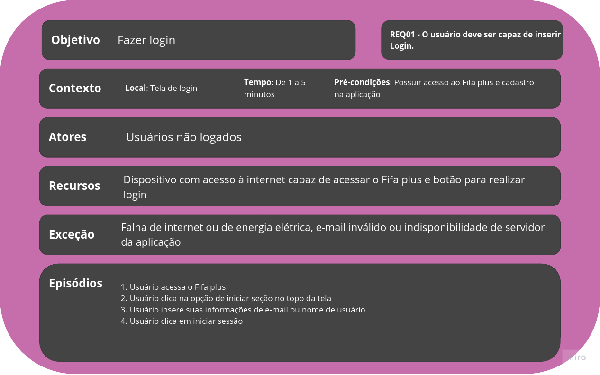

 Figura 14: Cenário 14. Fonte: Autoria própria.

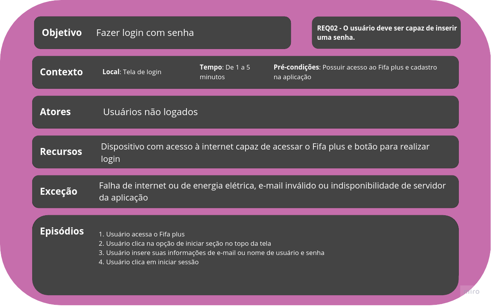

 Figura 15: Cenário 15. Fonte: Autoria própria.

## 4. Referências

> Puc-rio.br. Recuperado 12 de dezembro de 2022, de http://www-di.inf.puc-rio.br/~julio/bnncap3.pdf

## 5. Histórico de Versão
|    Data    | Versão |           Descrição            |    Autor    |     Revisor      |
| :--------: | :----: | :----------------------------: | :---------: | :--------------: |
| 12/12/2022 |  1.0   | Criação do documento e adição dos cenários | Eric Chagas | Thiago Cerqueira |