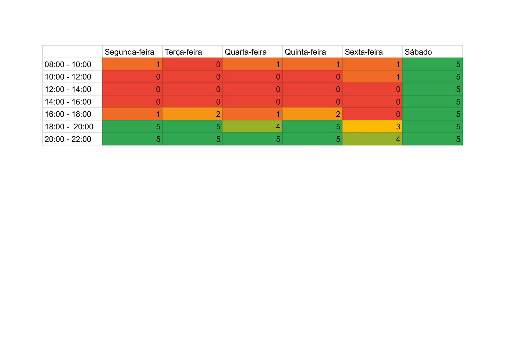

# Cronograma

## 1. Introdução

Com base nos prazos estipulados pela disciplida, este documento apresenta o cronograma geral das atividades (Tabela 1) e o cronograma de cada ponto de controle, com as datas de entrega da atividade, o integrante e a atividade que ele irá executar no ponto de controle e o revisor da atividade.

## 2. Cronograma de atividade

| Etapas |             Título             |                       Descrição                       | Entrega | Apresentação |
| :----: | :----------------------------: | :---------------------------------------------------: | :-----: | :----------: |
|   1    |          Planejamento          | Equipe, Definição do App, Planejamento e Rich Picture |  21/11  |    22/11     |
|   2    |    Elicitação de Requisitos    |                Técnicas e Priorização                 |  30/11  |    01/12     |
|   3    |    Modelagem de Requisitos     | Cenários, Léxico, Use Case, Especificação Suplementar |  12/12  |    13/12     |
|   4    | Modelagem de Requisitos - Ágil |     Histórias de Usuário, Backlog e NFR Framework     |  04/01  |    05/01     |
|  5.1   |    Análise de Requisitos I     |                Verificação e Validação                |  09/01  |    10/01     |
|  5.2   |    Análise de Requisitos II    |                Verificação e Validação                |  16/01  |    17/01     |
|   6    |      Pós-Rastreabilidade       |        Gerência de Desenvolvimento de Software        |  23/01  |    24/01     |
|   7    |      Conclusão do Projeto      |             Apresentação do Projeto final             |  01/02  |      -       |

###### Tabela 1: Cronograma geral das entregas. Fonte: Autoria própria.

## 3. Heatmap

!!! info "Disponibilidade da equipe"

    Foi feito um heatmap de disponibilidade de cada membro do time para melhor visualização da alocação de tarefas e datas no cronograma. O heatmap pode ser visualizado abaixo (Imagem 1).

###### Imagem 1: Heatmap. Fonte: Autoria própria.

## 4. Tabela de atividades

### 4.1 Etapa 1

|      Atividade      |      Autor(es)       | Data Limite Entrega |     Revisor(es)      | Data Limite Revisão |
| :-----------------: | :------------------: | :-----------------: | :------------------: | :-----------------: |
|    GitHub Pages     |     Eric Chagas      |     18/11/2022      | Charles, Eric, Rafael, Raphaela, Thiago e Wengel |     19/11/2022      |
|       HeatMap       |  Raphaela Guimarães  |     20/11/2022      |    Thiago Borges     |     20/11/2022      |
|     Ferramentas     |    Thiago Borges     |     20/11/2022      |   Rafael Fernandes   |     20/11/2022      |
|    Rich picture     |    Thiago Borges     |     20/11/2022      |     Eric Chagas      |     20/11/2022      |
|       Roadmap       |   Wengel Rodrigues   |     21/11/2022      |     Eric Chagas      |     21/11/2022      |
| Gravar Apresentação | Charles, Eric, Rafael, Raphaela, Thiago e Wengel |     21/11/2022      | Charles, Eric, Rafael, Raphaela, Thiago e Wengel |     21/11/2022      |
| Editar Apresentação |     Eric Chagas      |     21/11/2022      |          -           |          -          |

###### Tabela 2: Cronograma da Etapa 1. Fonte: Autoria própria.

### 4.2  Etapa 2

|                    Atividade                    |      Autor(es)       | Data Limite Entrega |     Revisor(es)      | Data Limite Revisão |
| :---------------------------------------------: | :------------------: | :-----------------: | :------------------: | :-----------------: |
|               Técnicas planejadas               | Eric Chagas e Wengel |     28/11/2022      |    Thiago Borges     |     29/11/2022      |
| Execução de técnicas (ser quebrada por técnica) | Charles, Eric, Rafael, Raphaela, Thiago e Wengel |     28/11/2022      | Charles, Eric, Rafael, Raphaela, Thiago e Wengel |     29/11/2022      |
|                   Priorização                   |  Charles e  Rafael   |     28/11/2022      |  Raphaela Guimarães  |     29/11/2022      |
|            Gravação da apresentação             | Charles, Eric, Rafael, Raphaela, Thiago e Wengel |     29/11/2022      |          -           |          -          |
|             Edição da apresentação              |   Wengel Rodrigues   |     29/11/2022      |          -           |          -          |

###### Tabela 3: Cronograma da Etapa 2. Fonte: Autoria própria.

### 4.3 Etapa 3

|         Atividade         |      Autor(es)       | Data Limite Entrega |   Revisor(es)    | Data Limite Revisão |
| :-----------------------: | :------------------: | :-----------------: | :--------------: | :-----------------: |
|       Casos de uso        |   Charles e Wengel   |     10/12/2022      |   Eric Chagas    |     11/11/2022      |
|         Cenários          |  Raphaela Guimarães  |     10/12/2022      | Wengel Rodrigues |     11/11/2022      |
|          Léxico           |    Thiago Borges     |     10/12/2022      | Rafael Fernandes |     11/11/2022      |
| Especificação Suplementar |   Rafael Fernandes   |     10/12/2022      |   Eric Chagas    |     11/11/2022      |
| Gravação da apresentação  | Charles, Eric, Rafael, Raphaela, Thiago e Wengel |     11/12/2022      |        -         |          -          |
|  Edição da apresentação   |   Wengel Rodrigues   |     12/12/2022      |        -         |          -          |

###### Tabela 4: Cronograma da Etapa 3. Fonte: Autoria própria.

### 4.4 Etapa 4

|                         Atividade                         |                    Autor(es)                     | Data Limite Entrega |   Revisor(es)    | Data Limite Revisão |
| :-------------------------------------------------------: | :----------------------------------------------: | :-----------------: | :--------------: | :-----------------: |
|                   Histórias de Usuário                    |                 Rafael e Wengel                  |     02/01/2023      |   Eric Chagas    |     03/01/2023      |
|                          Backlog                          |                 Charles e  Eric                  |     02/01/2023      |  Thiago Borges   |     03/01/2023      |
|                       NFR Framework                       |                Raphaela e Thiago                 |     02/01/2023      |     Charles      |     03/01/2023      |
|                 Gravação da apresentação                  | Charles, Eric, Rafael, Raphaela, Thiago e Wengel |     02/01/2023      |        -         |          -          |
|                  Edição da apresentação                   |                  Eric e Wengel                   |     03/01/2023      |        -         |          -          |
|            Adicionar página de atas de reunião            |                       Eric                       |     02/01/2023      | Rafael e Charles |     03/01/2023      |
| Criar documento de resultados da elicitação de requisitos |                  Eric e Thiago                   |     02/01/2023      |     Charles      |     03/01/2023      |
|                  Criar perfis de usuário                  |                  Charles e Eric                  |     02/01/2023      |     Raphaela     |     03/01/2023      |

###### Tabela 5: Cronograma da Etapa 4. Fonte: Autoria própria.

### 4.5 Etapa 5

|     Atividade     |      Autor(es)       | Data Limite Entrega |     Revisor(es)      | Data Limite Revisão |
| :---------------: | :------------------: | :-----------------: | :------------------: | :-----------------: |
| Avaliação Grupo X | Charles, Eric, Rafael, Raphaela, Thiago e Wengel |     07/01/2023      | Charles, Eric, Rafael, Raphaela, Thiago e Wengel |     08/01/2023      |

###### Tabela 6: Cronograma da Etapa 5. Fonte: Autoria própria.

### 4.6 Etapa 6

|         Atividade          |      Autor(es)       | Data Limite Entrega |    Revisor(es)     | Data Limite Revisão |
| :------------------------: | :------------------: | :-----------------: | :----------------: | :-----------------: |
| Verificação dos requisitos |   Charles e Rafael   |     13/01/2023      | Raphaela Guimarães |     14/01/2023      |
|  Validação dos requisitos  |   Thiago e Wengel    |     13/01/2023      |    Eric Chagas     |     14/01/2023      |
|  Gravação da apresentação  | Charles, Eric, Rafael, Raphaela, Thiago e Wengel |     14/01/2023      |         -          |          -          |
|   Edição da apresentação   |   Wengel Rodrigues   |     15/01/2023      |         -          |          -          |

###### Tabela 7: Cronograma da Etapa 6. Fonte: Autoria própria.

### 4.7 Etapa 7

|                 Atividade                  |      Autor(es)       | Data Limite Entrega |    Revisor(es)     | Data Limite Revisão |
| :----------------------------------------: | :------------------: | :-----------------: | :----------------: | :-----------------: |
| Seção de Pós-Rastreabilidade (doc inicial) | Eric Chagas e Wengel |     20/01/2023      | Raphaela Guimarães |     21/01/2023      |
|               Backward From                |  Raphael e Raphaela  |     20/01/2023      |    Eric Chagas     |     21/01/2023      |
|                Forward From                |   Thiago e Charles   |     20/01/2023      |    Eric Chagas     |     21/01/2023      |
|          Gravação da apresentação          | Charles, Eric, Rafael, Raphaela, Thiago e Wengel |     21/01/2023      |         -          |          -          |
|           Edição da apresentação           |   Wengel Rodrigues   |     22/01/2023      |         -          |          -          |

###### Tabela 8: Cronograma da Etapa 7. Fonte: Autoria própria.

### 4.8 Etapa 8
|                   Atividade                   |      Autor(es)       | Data Limite Entrega | Revisor(es) | Data Limite Revisão |
| :-------------------------------------------: | :------------------: | :-----------------: | :---------: | :-----------------: |
|   Planejamento de verificação dos artefatos   |          -           |     29/01/2023      |      -      |     30/01/2023      |
| Relato da verificação dos artefatos e ajustes |          -           |     29/01/2023      |      -      |     30/01/2023      |
|           Gravação da apresentação            | Charles, Eric, Rafael, Raphaela, Thiago e Wengel |     30/01/2023      |      -      |          -          |
|            Edição da apresentação             |   Wengel Rodrigues   |     31/01/2023      |      -      |          -          |

###### Tabela 9: Cronograma da Etapa 8. Fonte: Autoria própria.

## 5. Referências

SALES, André Barros. Plano de ensino da disciplina. Disponível em: <https://aprender3.unb.br/pluginfile.php/2307416/mod_resource/content/22/Plano_de_Ensino%20RE%20202202%20Turma%202.pdf>. Acesso em: 21 de novembro de 2022;

Entregas do Projeto de Requisitos. Disponível em: <https://aprender3.unb.br/course/view.php?id=16379#section-11>. Acesso em: 21 de novembro de 2022;

## Histórico de versão do arquivo

|    Data    | Versão |                Descrição                |                Autor(es)                | Revisor(es) |
| :--------: | :----: | :-------------------------------------: | :-------------------------------------: | ----------- |
| 21/11/2022 |  1.0   | Versão inicial do cronograma do projeto |            Wengel Rodrigues             | Wengel      |
| 21/11/2022 |  1.1   |          Adicionado o Heatmap           | Raphaela Guimarães de Araújo dos Santos | Eric        |
| 26/11/2022 |  1.2   |       Inclusão das outras etapas        |            Wengel Rodrigues             | Wengel      |
| 29/11/2022 |  1.3   |          Ajustes no cronograma          |            Wengel Rodrigues             | Thiago      |
| 29/12/2022 |  1.4   |          Ajustes no cronograma          |               Eric Chagas               | Thiago      |

###### Tabela 10 - Histórico de versões. Fonte: Autoria própria.