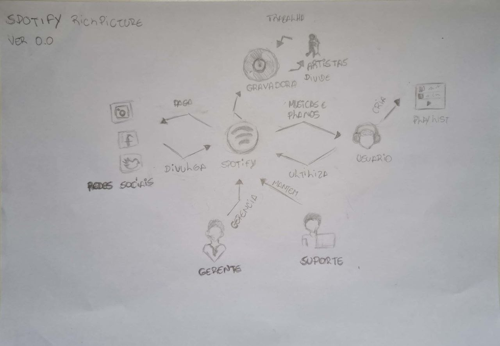

# RichPicture

## 1. Introdução

Um Rich Picture é um desenho que ilustra os principais elementos e relacionamentos que precisam ser considerados na tentativa de auxiliar a representação de sistemas. Consiste em figuras, texto, símbolos e ícones, todos usados ​​para ilustrar a situação. É chamado de Rich Picture, pois ilustra a riqueza e a complexidade de uma situação.

## 2. Metologia

    Para a criação dos richpictures foi utilizado lapis e papel.

## Versão 1

## RP 00 Visão Geral

###### Figura 1 - Rich Picture do Spotify (aplicativo inicial do projeto). Fonte: Autoria própria.

## 2. Histórico de Versões

|    Data    | Versão |                           Descrição                            |        Autor(es)        | Revisor(es) |
| :--------: | :----: | :------------------------------------------------------------: | :---------------------: | :---------: |
| 10/11/2022 |  1.0   | Realizado primeiro rascunho do RichPicture sobre a visão geral | Thiago Cerqueira Borges |     Eric    |

###### Tabela 1 - Histórico de versões. Fonte: Autoria própria.